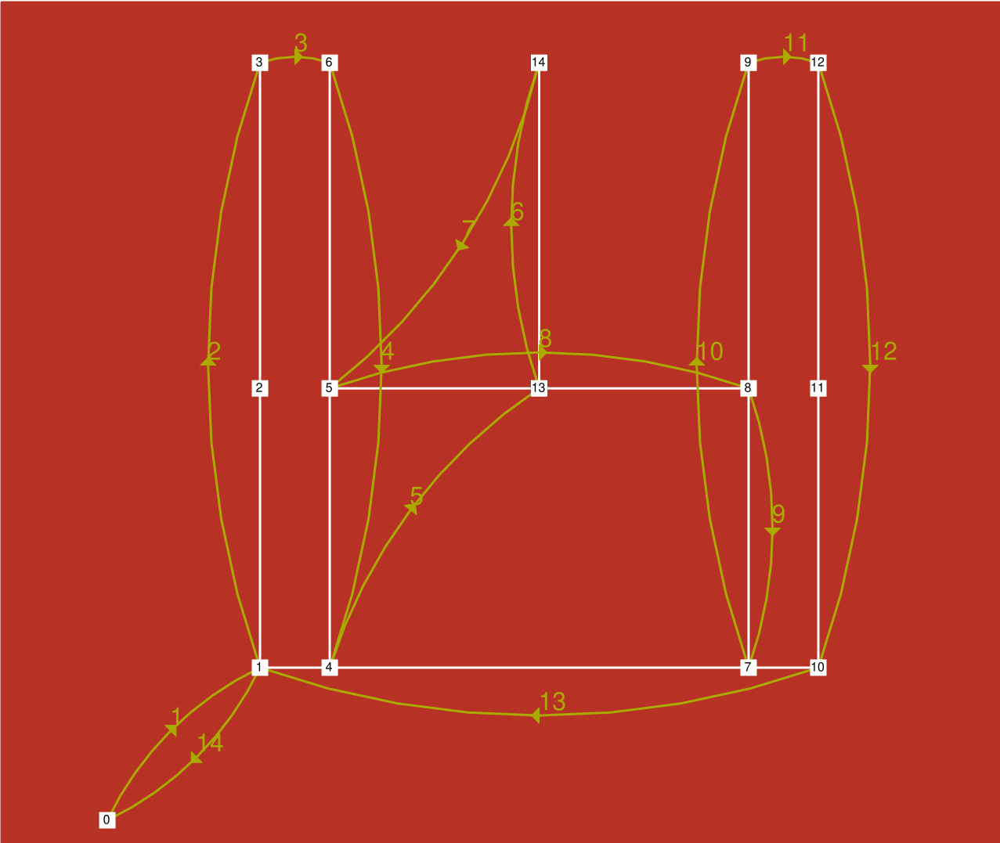

# Sweeping clay court lines optimally

Ahh, the joy of tennis on clay courts. Nothing's more fun than power sliding through the red dust. Alas, unless you keep your lines clean during the match like Rafael Nadal likes to do, you will have to brush them afterwards. Naturally, you'll want to know the fastest way to get this done and move on to dinner. Read on...

Let's assume there are two brushes on the court, so that we are only responsible for cleaning one side. Typically, the brush is stored in one of the back edges of the court. We can model our half of the court as a graph with 15 vertices, vertex 0 representing the initial position of the brush:


Some of the vertices are connected by lines. The idea is to find the shortest tour starting in 0 that visits every line. Vertices 2 and 11 might seem unnecessary. I've included them out of curiosity: some people like to sweep the side lines "in parallel" by doing something like 1-2, 4-5-6, 2-3. Note that the solution might contain cycles as well as paths that do not correspond to lines. Also note that for lines of length 0, this problem is equivalent to the [Travelling Salesman Problem](https://en.wikipedia.org/wiki/Travelling_salesman_problem), which is [NP-hard](https://en.wikipedia.org/wiki/NP-hardness).

One way to find a solution is to list off every possible sequence of vertices and find the shortest one that brushes every line. Note that the maximum length of the solution sequence is twice the number of lines (plus one) because there is no point in having paths longer than one in between two lines (and we have to go back to 0). Assuming we can check every candidate solution in linear time, the time complexity of this algorithm is $$\mathcal{O}\left( \sum\_{n=1}^{2l-1} v^n n \right),$$ \\(l\\) being the number of lines and \\(v\\) the number of vertices.

Another way is to enumerate all the sequences of lines, then compute every sequence of vertices corresponding to that sequence of lines (there might be multiple) and take the shortest overall. The time complexity of this solution is $$ \mathcal{O}\left( l!2^ll \right). $$

Finally, there's dynamic programming. Recursively, the optimal solution starts with some edge to a new vertex, then proceeds with the optimal path starting in that vertex and ending in 0 via the remaining lines. We do that until no lines remain, at which point we just go put the brush back and move on to dinner. In pseudocode:

```python
def shortest_tour(start_vertex, remaining_lines):
    if not remaining_lines:
        return distance(start_vertex, vertices[0])

    min_cost = float('inf')
    for v in vertices:
        cost = distance(start_vertex, v)
            + shortest_tour(v, remaining_lines - (start_vertex, v))
        min_cost = min(min_cost, cost)

    return min_cost
```

There's a catch here, though: when `(start_vertex, v)` is not a line, the problem doesn't make any progress, and we get stuck in an infinite loop. In other words: the subproblem dependency graph of this formulation contains cycles. A possible way out is to proceed breadth-first instead of depth-first. This would require to keep a queue of open subproblems. Before adding a subproblem, the queue would have to be checked to make sure the same subproblem is not added repeatedly. With \\(f(l,v)\\) representing the time complexity of this check, the time complexity of this algorithm would be $$ \mathcal{O}\left( v2^lvf(l,v) \right). $$ We could also limit the recursion depth to a maximum of \\(d\\) and return infinite costs once that limit is reached. Since the function might be called up to \\(d\\) times on the same subproblem, this would give a time complexity of $$ \mathcal{O}\left( v2^lvd \right). $$ As mentioned earlier, the recursion depth of this problem can be bounded.

We can also use the observation that paths of more than one edge between brushing two lines are always suboptimal (due to the [Triangle Inequality](https://en.wikipedia.org/wiki/Triangle_inequality)) by including an additional variable to the problem. The new variable can take two values, indicating whether or not the next step must be along a line, which is the case exactly when no line was taken in the previous step. While we're at it, we can make another simple optimization by only considering vertices that are incident to remaining lines and excluding the current one. In pseudocode:

```python
def shortest_tour(start_vertex, remaining_lines, must_take_line):
    if not remaining_lines:
        return distance(start_vertex, vertices[0])

    min_cost = float('inf')
    for v in get_vertices(remaining_lines) - { start_vertex }:
        took_line = (start_vertex, v) in remaining_lines
        if must_take_line and not took_line:
            continue

        cost = distance(start_vertex, v)
            + shortest_tour(v, remaining_lines - (start_vertex, v), not took_line)
        min_cost = min(min_cost, cost)

    return min_cost
```

The resulting algorithm has a time complexity of $$ \mathcal{O}\left( v2^lv2 \right). $$

Now all that's left is to memoize the function, add backtracking information (i.e. the vertex of least cost and corresponding `not took_line`) to the return value, run it, and voilà:


The optimal tour has a length of approximately 102 m and is depicted below. It starts with the left side lines, goes on with the "T", the right side lines and the base line.


Note that vertices 2 and 11 indeed proved unnecessary.

Also note that the solution requires you to stop at vertex 13, brush the center line, and resume with the right service line. Some people don't like to stop in the middle of lines. Here's the solution taking only complete lines:



It clocks in at slightly over 104 m, about 3 -- 4 adult steps more than the previous solution. The principle remains the same: start with the side lines, do the "T", the other side lines, and the base line. Easy!
